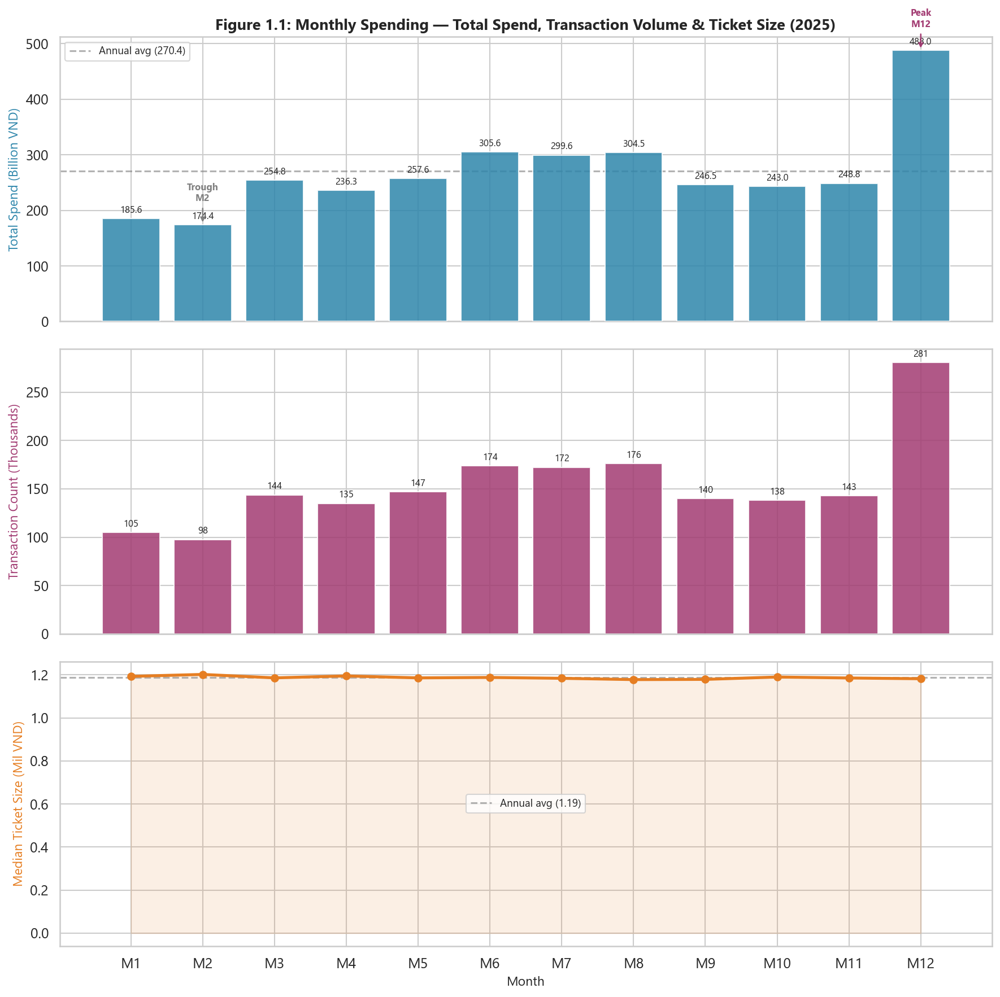
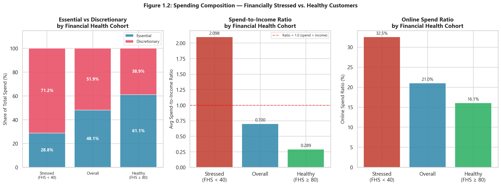
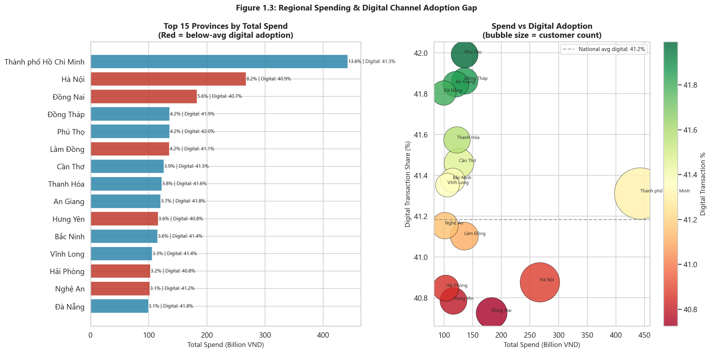
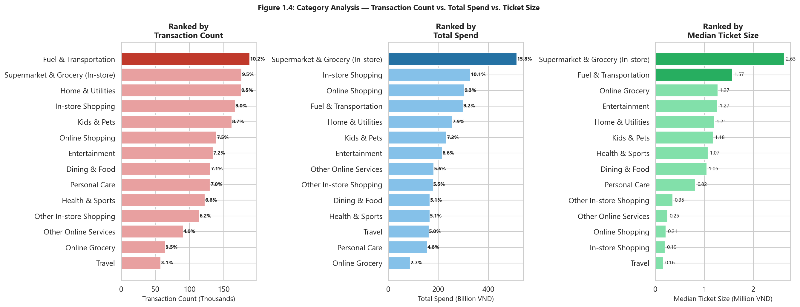
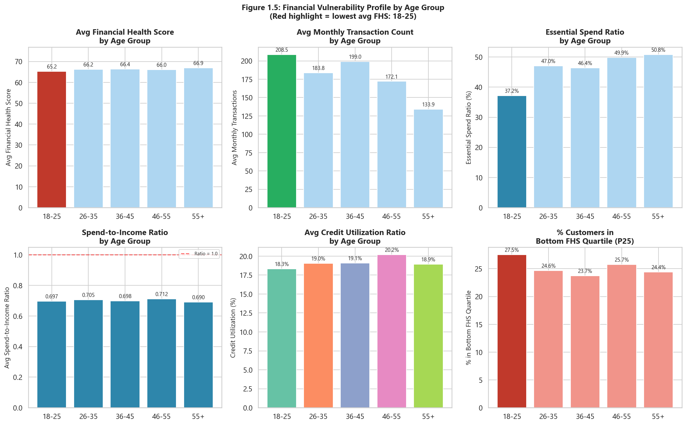

# Task 1: Exploratory Data Analysis (EDA)
*Consumer Financial Health & Engagement - Vietnam 2025 (Synthetic Data)*

---

## Overview

| Metric | Value |
|--------|-------|
| Total Transactions | 1,852,394 |
| Unique Customers | 999 |
| Total Spend | 3244.6 Billion VND |
| Time Period | Jan 2025 – Dec 2025 |

---

## Q1. Peak Month — Volume vs. Ticket Size Driver

| Month | Total Spend (Bil VND) | % of Annual | Transactions | Median Ticket (Mil VND) | Active Customers |
|:-----:|----------------------:|:-----------:|-------------:|------------------------:|----------------:|
| M01 | 185.6 | 5.7% | 104,727 | 1.19 | 916 |
| M02 ▼ | 174.4 | 5.4% | 97,657 | 1.20 | 919 |
| M03 | 254.8 | 7.9% | 143,789 | 1.19 | 920 |
| M04 | 236.3 | 7.3% | 134,970 | 1.20 | 919 |
| M05 | 257.6 | 7.9% | 146,875 | 1.19 | 917 |
| M06 | 305.6 | 9.4% | 173,869 | 1.19 | 911 |
| M07 | 299.6 | 9.2% | 172,444 | 1.18 | 913 |
| M08 | 304.5 | 9.4% | 176,118 | 1.18 | 911 |
| M09 | 246.5 | 7.6% | 140,185 | 1.18 | 919 |
| M10 | 243.0 | 7.5% | 138,106 | 1.19 | 917 |
| M11 | 248.8 | 7.7% | 143,056 | 1.19 | 912 |
| M12 ▲ | 488.0 | 15.0% | 280,598 | 1.18 | 918 |

**Key Findings:**
- **Peak month: M12** - 488.0 Bil VND (15.0% of annual total), 280,598 transactions.
- **Lowest month: M02** - 174.4 Bil VND (5.4%), 97,657 transactions.
- **Peak/trough spend ratio: 2.80×** vs **peak/trough transaction count ratio: 2.87×**.
- **Median ticket size is highly stable** across all months: max M02 = 1.202 Mil VND vs min M08 = 1.178 Mil VND (difference = 0.024 Mil VND, < 2% variation).
- **Conclusion: The peak is driven by TRANSACTION VOLUME, not ticket size.** Customers transact more frequently during the peak period but do not spend significantly more per transaction. This suggests seasonal behavioral triggers (promotions, holidays, year-end bonuses) that increase purchasing frequency.

---

## Q2. Essential vs. Discretionary Spend — Stressed vs. Healthy Customers

*Stress threshold: `financial_health_score < 40` | Healthy threshold: `financial_health_score ≥ 80`*

| Metric | Stressed (FHS < 40) | Overall | Healthy (FHS ≥ 80) |
|:-------|--------------------:|--------:|-------------------:|
| Unique Customers | 70 (7.0%) | 999 (100%) | 303 (30.3%) |
| Avg Financial Health Score | 29.1 | 66.4 | 82.0 |
| Essential Spend Ratio | **28.8%** | 48.1% | **61.1%** |
| Discretionary Spend Ratio | 71.2% | 51.9% | 38.9% |
| Avg Spend-to-Income Ratio | 2.098 | 0.700 | 0.289 |
| Online Spend Ratio | 32.5% | 21.0% | 16.1% |

**Key Findings:**
- **Stressed customers (70 unique consumers, 7.0% of base)** allocate only **28.8%** to essential spending - **32.3 percentage points lower** than healthy customers (61.1%).
- Counter-intuitively, stressed customers spend **more** on discretionary items (71.2%) than healthy ones (38.9%), suggesting **impulsive or uncontrolled discretionary spending** as a potential driver of financial stress.
- **Spend-to-income ratio** for stressed customers: **2.098** (> 1.0 — spending exceeds income) vs 0.289 for healthy customers.
- Implication: financial wellness interventions should focus on **discretionary spend awareness** rather than essential-needs assistance for the stressed segment.

---

## Q3. Provinces with High Spend but Below-Average Digital Adoption

*National average digital transaction share: **41.2%***

| # | Province/City | Total Spend (Bil VND) | Spend Share | Customers | Digital Txn % | Gap vs National Avg |
|:-:|:--------------|----------------------:|:-----------:|----------:|:-------------:|:-------------------:|
| 3 | **Đồng Nai** | 183.1 | 5.6% | 49 | 40.7% | -0.5pp |
| 10 | **Hưng Yên** | 116.4 | 3.6% | 37 | 40.8% | -0.4pp |
| 13 | **Hải Phòng** | 103.2 | 3.2% | 35 | 40.8% | -0.3pp |
| 2 | **Hà Nội** | 267.3 | 8.2% | 80 | 40.9% | -0.3pp |
| 6 | **Lâm Đồng** | 135.4 | 4.2% | 40 | 41.1% | -0.1pp |
| 14 | **Nghệ An** | 101.7 | 3.1% | 36 | 41.2% | -0.0pp |

**Channel breakdown for provinces with digital adoption gap:**

| Province/City | POS | QR Payment | E-commerce | Mobile App | Recurring Payment |
|:--------------|:-----:|:-----:|:-----:|:-----:|:-----:|
| Hà Nội | 59.1% | 19.9% | 9.2% | 7.4% | 4.4% |
| Hưng Yên | 58.7% | 20.3% | 9.3% | 7.0% | 4.7% |
| Hải Phòng | 58.5% | 20.5% | 9.0% | 7.4% | 4.6% |
| Lâm Đồng | 58.7% | 19.9% | 9.3% | 7.6% | 4.6% |
| Nghệ An | 57.3% | 20.2% | 10.1% | 7.9% | 4.5% |
| Đồng Nai | 58.7% | 19.7% | 9.8% | 7.3% | 4.6% |

**Key Findings:**
- **6** of the top-15 spending provinces show digital adoption slightly below the national average of 41.2%.
- **Đồng Nai**: 183.1 Bil VND total spend with **40.7%** digital share -**0.5pp below** the national average.
- **Hưng Yên**: 116.4 Bil VND, **40.8%** digital - 0.4pp gap.
- **Note on gap magnitude**: The absolute digital adoption gaps are small (<1pp across provinces), indicating digital adoption is broadly uniform nationally. The more meaningful story is the **structural channel mix**: POS accounts for ~58–59% of transactions in every province - even in Hà Nội and major economic hubs.
- **The real opportunity is channel shift, not just digital acquisition**: QR Payment (~20% share) is already the highest-reach digital channel, positioned as the lowest-friction upgrade from POS. Campaigns nudging existing POS customers toward QR at the same merchants require no change in shopping behavior - only payment behavior.
- **Priority provinces**: High-spend, POS-dominant provinces represent the greatest volume opportunity for digital conversion campaigns (QR Payment and Mobile App).

---

## Q4. Top Category: Transaction Count vs. Total Spend - Ticket Size Comparison

| Spend Rank | Category | Total Spend (Bil VND) | Spend Share | Txns | Txn Share | Txn Rank | Median Ticket (Mil VND) |
|:----------:|:---------|----------------------:|:-----------:|-----:|:---------:|:--------:|------------------------:|
| 1 | **Supermarket & Grocery (In-store)** | 513.8 | 15.8% | 176,191 | 9.5% | 2 | 2.626 |
| 2 | In-store Shopping | 328.4 | 10.1% | 166,463 | 9.0% | 4 | 0.194 |
| 3 | Online Shopping | 302.8 | 9.3% | 139,322 | 7.5% | 6 | 0.211 |
| 4 | **Fuel & Transportation** | 298.4 | 9.2% | 188,029 | 10.2% | 1 | 1.572 |
| 5 | Home & Utilities | 255.2 | 7.9% | 175,460 | 9.5% | 3 | 1.207 |
| 6 | Kids & Pets | 232.6 | 7.2% | 161,727 | 8.7% | 5 | 1.178 |
| 7 | Entertainment | 215.1 | 6.6% | 134,118 | 7.2% | 7 | 1.271 |
| 8 | Other Online Services | 181.7 | 5.6% | 90,654 | 4.9% | 12 | 0.247 |
| 9 | Other In-store Shopping | 179.0 | 5.5% | 114,229 | 6.2% | 11 | 0.350 |
| 10 | Dining & Food | 166.7 | 5.1% | 130,729 | 7.1% | 8 | 1.050 |
| 11 | Health & Sports | 165.7 | 5.1% | 122,553 | 6.6% | 10 | 1.070 |
| 12 | Travel | 161.9 | 5.0% | 57,956 | 3.1% | 14 | 0.156 |
| 13 | Personal Care | 156.3 | 4.8% | 130,085 | 7.0% | 9 | 0.818 |
| 14 | Online Grocery | 87.1 | 2.7% | 64,878 | 3.5% | 13 | 1.273 |

**Key Findings:**
- **Top category by transaction count**: `Fuel & Transportation` - 188,029 transactions (10.2% of all txns), spend rank #4.
- **Top category by total spend**: `Supermarket & Grocery (In-store)` - 513.8 Bil VND (15.8% of total), txn rank #2.
- **Ticket size comparison**: `Fuel & Transportation` median = 1.572 Mil VND | `Supermarket & Grocery (In-store)` median = 2.626 Mil VND (ratio: 1.67×).
- **Behavioral interpretation**: `Fuel & Transportation` reflects **high-frequency, low-value** everyday purchases (convenience-driven). `Supermarket & Grocery (In-store)` reflects **low-frequency, high-value** purchases (planned, deliberate spending). Marketing strategies should differ: volume-based rewards for the former, installment plans or cashback for the latter.

---

## Q5. Age Cohort with Lowest Financial Health Score - Vulnerability Profile

| Age Group | Consumers | Avg FHS | Avg Monthly Txns | Essential % | Spend/Income | Credit Util % | % Bottom Quartile FHS |
|:---------:|----------:|--------:|-----------------:|:-----------:|:------------:|:-------------:|:---------------------:|
| **18-25** | 84 | **65.21** | 208.5 | 37.2% | 0.697 | 18.3% | 27.5% |
| 26-35 | 183 | 66.18 | 183.8 | 47.0% | 0.705 | 19.0% | 24.6% |
| 36-45 | 161 | 66.38 | 199.0 | 46.4% | 0.698 | 19.1% | 23.7% |
| 46-55 | 196 | 66.04 | 172.1 | 49.9% | 0.712 | 20.2% | 25.7% |
| 55+ | 375 | 66.90 | 133.9 | 50.8% | 0.690 | 18.9% | 24.4% |

**Key Findings:**
- **Most financially vulnerable cohort: `18-25`** - lowest average FHS at **65.21** across all age groups.
- **Context on FHS variance**: The FHS range across age groups is narrow (65.21-66.90, spread of 1.68 points). This means the `18-25` group's vulnerability is **relative**, not extreme. The real signal lies in the **composition of their spending and income utilization**.
- This cohort also records the **highest transaction frequency: 208.5 txns/month** - demonstrating active market participation. High frequency with low FHS suggests **volume of small discretionary purchases** as the vulnerability driver.
- **Essential spend ratio: 37.2%** - **the lowest among all age groups** (vs 50.8% for 55+). The 18-25 cohort directs **62.8%** of spend to discretionary items - the highest discretionary ratio in the dataset. This lifestyle-driven spending pattern is the primary driver of lower financial health scores.
- **Spend-to-income ratio: 0.697** - while under 1.0, this cohort commits **69.7%** of synthetic income to spending, leaving limited buffer for savings or unexpected expenses.
- **Root cause**: Early-career income constraints combined with discretionary-heavy spending aspirations (dining, entertainment, online shopping) create financial fragility in the 18-25 cohort, even when absolute FHS scores appear moderate. The low essential ratio (37.2% vs 50.8% for 55+) is the clearest behavioral signal.
- **Recommendation**: Deploy real-time budgeting nudges and discretionary spend alerts for the 18-25 cohort via Mobile App (their highest-used digital channel). Gamified savings goals and category spend summaries are well-suited to this demographic.

---

## Summary of EDA Findings

| # | Question | Key Metric | Finding |
|:-:|:---------|:----------:|:--------|
| Q1 | Peak month driver | Volume vs Ticket | Peak M12: 488.0B VND (15.0%). Driven by 2.9× transaction volume spike, ticket size stable (<2% variation) |
| Q2 | Stressed vs Healthy spending | Essential ratio | Stressed: 28.8% essential vs Healthy: 61.1%. Stressed customers spend more on discretionary — impulsive spending driver |
| Q3 | Province digital gap | Digital txn % | 6 top provinces below 41.2% national avg digital adoption. POS-dominant. Targeted nudges needed |
| Q4 | Category usage | Ticket size | `Fuel & Transportation` #1 by txn count (10.2%). `Supermarket & Grocery (In-store)` #1 by spend (15.8%). 1.67× ticket size gap |
| Q5 | Age vulnerability | Avg FHS | `18-25` has lowest FHS (65.2) with 209 txns/mo and 37.2% essential ratio |
