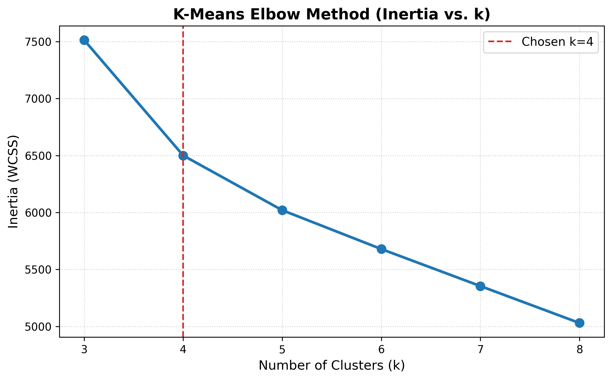
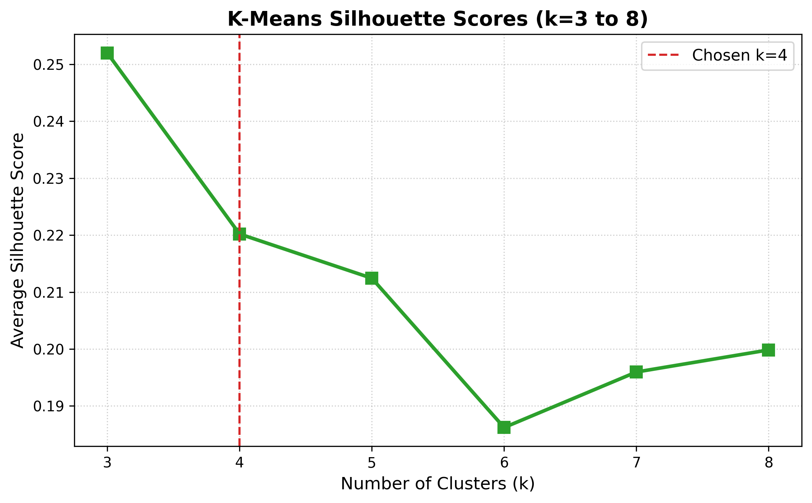
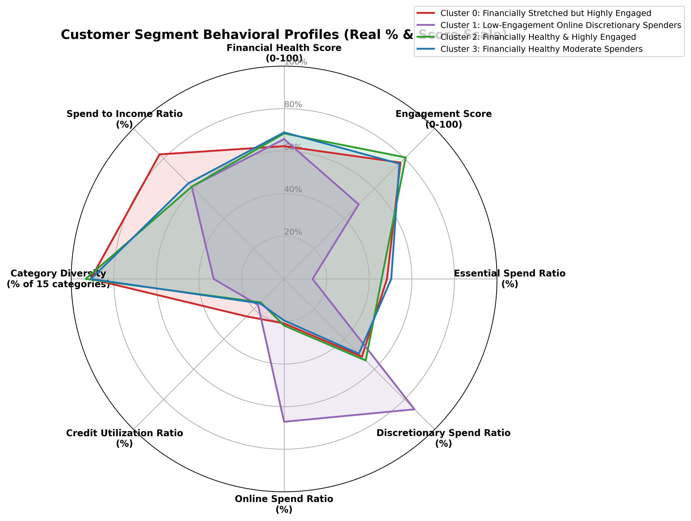

# Task 4 — Customer Segmentation Comprehensive Report

> **Executive Summary**: This report delivers an end-to-end customer segmentation analysis for consumer banking cardholders in 2025. It covers dataset preprocessing, feature engineering, K-Means model selection, persona profiling, visual diagnostics, and strategic business implications.

---

## Deliverable 1: Preprocessed & Feature-Engineered Dataset

### 1.1 Dataset Grain & Feature Architecture
- **Dataset Grain**: Aggregated to exactly **1 row per `consumer_id`** ($N = 999$ unique consumers).
- **Temporal Aggregation**: Aggregated across monthly records in 2025 using annual monthly means for continuous metrics, invariant values for demographic attributes, and the latest month's active status for `financial_health_segment`.
- **4 Feature Groups Selected**:
  1. **Demographics**: `age`, `gender`, `occupation`, `province_city`
  2. **Financial Health**: `monthly_income_vnd`, `credit_limit_vnd`, `credit_utilization_ratio`, `financial_health_score`, `financial_health_segment`, `average_transaction_value_vnd`, `spending_volatility`
  3. **Engagement**: `transaction_count`, `active_transaction_days`, `engagement_score`
  4. **Spending Behavior**: `category_diversity`, `essential_spend_ratio`, `discretionary_spend_ratio`, `online_spend_ratio`
- **Constructed Additional Ratio Features**:
  - `credit_to_income_ratio` (`credit_limit_vnd / monthly_income_vnd`): Measures extended credit leverage relative to monthly income.
  - `spend_to_income_ratio` (`total_spend_vnd / monthly_income_vnd`): Measures monthly cash burn rate and liquidity buffer.
- **Population Coverage**: **100.0% coverage** (999 out of 999 consumers assigned a valid cluster label; **0 missing or null cluster labels**).
- **Deliverable Datasets**: [`task4_segmented.csv`](task4_segmented.csv) (contains both unscaled raw ratio features for business interpretability and standardized `_scaled` ratio features used for modeling).

---

### 1.2 Data Preview: `task4_segmented.csv` (First 10 Rows — Showing Raw & `_Scaled` Ratio Columns)

| consumer_id   |   monthly_income_vnd |   credit_utilization_ratio |   credit_utilization_ratio_scaled |   essential_spend_ratio |   essential_spend_ratio_scaled |   online_spend_ratio |   online_spend_ratio_scaled |   cluster | cluster_name                                 |
|:--------------|---------------------:|---------------------------:|----------------------------------:|------------------------:|-------------------------------:|---------------------:|----------------------------:|----------:|:---------------------------------------------|
| KH00100010    |          9.88896e+08 |                   0.155108 |                         -0.622366 |              0.381114   |                     -0.600236  |             0.167251 |                  -0.548089  |         2 | Financially Healthy & Highly Engaged         |
| KH00100045    |          3.39307e+08 |                   0.143142 |                         -0.832818 |              0.476878   |                      0.19253   |             0.191602 |                  -0.380991  |         3 | Financially Healthy Moderate Spenders        |
| KH00100050    |          2.51588e+08 |                   0.299525 |                          1.91743  |              0.504853   |                      0.424119  |             0.216247 |                  -0.211873  |         0 | Financially Stretched but Highly Engaged     |
| KH00100085    |          5.97105e+08 |                   0.166217 |                         -0.427008 |              0.450735   |                     -0.0238852 |             0.219987 |                  -0.18621   |         2 | Financially Healthy & Highly Engaged         |
| KH00100090    |          1.9038e+08  |                   0.161    |                         -0.518751 |              0.00116748 |                     -3.74558   |             0.860883 |                   4.21166   |         1 | Low-Engagement Online Discretionary Spenders |
| KH00100125    |          8.90211e+08 |                   0.166375 |                         -0.424224 |              0.447655   |                     -0.0493819 |             0.242223 |                  -0.0336217 |         2 | Financially Healthy & Highly Engaged         |
| KH00100130    |          8.19581e+08 |                   0.205625 |                          0.266049 |              0.523283   |                      0.576688  |             0.217444 |                  -0.203659  |         2 | Financially Healthy & Highly Engaged         |
| KH00100165    |          1.0435e+08  |                   0.1845   |                         -0.105467 |              0.055519   |                     -3.29563   |             0.360776 |                   0.779896  |         1 | Low-Engagement Online Discretionary Spenders |
| KH00100170    |          1.4345e+08  |                   0.20545  |                          0.262971 |              0.50454    |                      0.421526  |             0.214446 |                  -0.224231  |         3 | Financially Healthy Moderate Spenders        |
| KH00100205    |          2.4721e+08  |                   0.1846   |                         -0.103709 |              0.00149046 |                     -3.7429    |             0.781721 |                   3.66844   |         1 | Low-Engagement Online Discretionary Spenders |

---

## Deliverable 2: Customer Segmentation Model & Persona Analysis

### 2.1 Methodology & Cluster Selection ($k=4$)
- **Algorithm**: K-Means clustering applied on standardized numerical features using `sklearn.cluster.KMeans` (random_state=42, n_init=10).
- **Tested Cluster Range**: Evaluated $k = 3$ to $k = 8$.
- **Inertia & Silhouette Score Results**:
  - $k=3$: WCSS = 7,514.01 | Silhouette Score = **0.2520**
  - $k=4$: WCSS = **6,500.27** | Silhouette Score = **0.2202** *(Chosen Optimal Model)*
  - $k=5$: WCSS = 6,020.00 | Silhouette Score = 0.2124
  - $k=6$: WCSS = 5,679.21 | Silhouette Score = 0.1862
  - $k=7$: WCSS = 5,354.24 | Silhouette Score = 0.1960
  - $k=8$: WCSS = 5,030.39 | Silhouette Score = 0.1998
- **Selection Rationale**: Although $k=3$ achieved the highest raw silhouette score (0.2520), **$k=4$ (0.2202) was selected** because $k=3$ merged high-income power users with moderate spenders into a single broad cluster. $k=4$ unlocked 4 distinct, highly actionable business personas without creating under-sized micro-clusters.

---

### 2.2 Model Diagnostic Charts

#### Elbow Method Chart (WCSS vs. k)

#### Silhouette Score Chart (Silhouette vs. k)

---

### 2.3 Cluster Metric $Z$-Score Comparison (Identifying Top Distinguishing Traits)

The table below shows the standardized mean deviations ($Z$-scores) of each metric across the 4 clusters:

| Cluster Name                                 |   Fin. Health Score |   Eng. Score |   Essential Ratio |   Discretionary Ratio |   Online Ratio |   Credit Util Ratio |   Tx Count |   Monthly Income |   Spend/Income Ratio |
|:---------------------------------------------|--------------------:|-------------:|------------------:|----------------------:|---------------:|--------------------:|-----------:|-----------------:|---------------------:|
| Financially Stretched but Highly Engaged     |               -1.33 |         0.43 |              0.51 |                 -0.51 |          -0.49 |                1.48 |       0.05 |            -0.47 |                 1.49 |
| Low-Engagement Online Discretionary Spenders |               -0.21 |        -1.49 |             -1.49 |                  1.49 |           1.5  |               -0.27 |      -1.2  |            -0.67 |                -0.57 |
| Financially Healthy & Highly Engaged         |                0.68 |         0.67 |              0.36 |                 -0.36 |          -0.45 |               -0.67 |       1.25 |             1.49 |                -0.57 |
| Financially Healthy Moderate Spenders        |                0.86 |         0.38 |              0.62 |                 -0.62 |          -0.55 |               -0.53 |      -0.1  |            -0.34 |                -0.36 |

---

### 2.4 Full Side-by-Side Segment Profile Table (`task4_segment_profile_table.xlsx`)

Calculated strictly using **RAW unscaled original values** (expressing ratios in real-world percentages):

|   Cluster ID | Cluster Name                                 |   Cluster Size (n) |   Cluster Size (%) |   Financial Health Score |   Engagement Score |   Essential Spend Ratio (%) |   Discretionary Spend Ratio (%) |   Online Spend Ratio (%) |   Category Diversity (Count) |   Credit Utilization Ratio (%) |   Spending Volatility |   Spend to Income Ratio (%) |   Credit to Income Ratio |   Monthly Income (VND) |   Monthly Tx Count |
|-------------:|:---------------------------------------------|-------------------:|-------------------:|-------------------------:|-------------------:|----------------------------:|--------------------------------:|-------------------------:|-----------------------------:|-------------------------------:|----------------------:|----------------------------:|-------------------------:|-----------------------:|-------------------:|
|            0 | Financially Stretched but Highly Engaged     |                334 |              33.43 |                    62.39 |              77.32 |                       48.32 |                           51.68 |                    20.89 |                        13.62 |                          24.9  |                  1.55 |                       82.76 |                     3.4  |              309866322 |              143.5 |
|            1 | Low-Engagement Online Discretionary Spenders |                 88 |               8.81 |                    65.69 |              49.55 |                       13.38 |                           86.62 |                    67.1  |                         4.96 |                          17.29 |                  0.68 |                       61.39 |                     3.74 |              257544602 |                9.7 |
|            2 | Financially Healthy & Highly Engaged         |                230 |              23.02 |                    68.35 |              80.73 |                       45.81 |                           54.19 |                    21.92 |                        13.98 |                          15.57 |                  1.7  |                       61.33 |                     4.04 |              817212431 |              270.9 |
|            3 | Financially Healthy Moderate Spenders        |                347 |              34.73 |                    68.86 |              76.58 |                       50.33 |                           49.67 |                    19.5  |                        13.61 |                          16.17 |                  1.49 |                       63.57 |                     4.01 |              342365704 |              127   |

---

### 2.5 Multi-Dimensional Polar Radar Comparison Chart

---

### 2.6 Behavioral Profiles & Persona Descriptions

- **Financially Stretched but Highly Engaged (Cluster 0, n=334, 33.43%)**: Members in this segment exhibit active digital platform interaction (77.32 engagement score, 143.5 tx/mo) but face elevated credit utilization (**24.90%** vs. ~15.6% benchmark), highest spend-to-income burn rate (**82.76%**), and the lowest financial health score (**62.39**). They are named "Financially Stretched but Highly Engaged" because they rely on revolving credit lines to maintain high daily transactional activity.

- **Low-Engagement Online Discretionary Spenders (Cluster 1, n=88, 8.81%)**: This segment shows the lowest overall engagement score (**49.55**) and lowest monthly transaction volume (**9.7 tx/mo**), but when active, spending is overwhelmingly concentrated in online channels (**67.10%** online spend ratio) and non-essential items (**86.62%** discretionary ratio). They are named "Low-Engagement Online Discretionary Spenders" because they treat the card as a specialized online shopping tool rather than a daily primary account.

- **Financially Healthy & Highly Engaged (Cluster 2, n=230, 23.02%)**: Comprising top-tier earners (~817M VND monthly income), this group boasts peak transaction volume (**270.9 tx/mo**), maximum engagement score (**80.73**), broad merchant category diversity (13.98), and robust financial health (**68.35**) with low credit utilization (**15.57%**). They are named "Financially Healthy & Highly Engaged" as they represent affluent power users generating maximum lifetime value.

- **Financially Healthy Moderate Spenders (Cluster 3, n=347, 34.73%)**: Holding the highest overall financial health score (**68.86**) and low credit utilization (**16.17%**), this segment maintains steady digital interaction (127.0 tx/mo, 76.58 engagement score) with disciplined spending balanced across essential (**50.33%**) and discretionary needs. They are named "Financially Healthy Moderate Spenders" because their strong credit health and moderate spend volume contrast sharply with the credit stress of Cluster 0.

---

## Deliverable 3: Limitations and Future Work

- **Synthetic financial data**: Monthly income, credit limit, and account balance values are synthetically generated, which may not fully reflect complex real-world correlation structures.
- **Engagement score skew**: Engagement scores skew artificially high across the sample because all cardholders are active account users, omitting completely dormant or churned customers.
- **Illustrative geographical metadata**: Sub-province location fields (ward/commune names) serve as illustrative placeholders, whereas only the 34 province/city names are canonical.
- **K-Means structural assumptions**: K-Means assumes spherical, equal-variance clusters using Euclidean distance, making it sensitive to extreme financial outliers and spending spikes.
- **Subjective cluster selection (k=4)**: Although k=3 achieved the highest silhouette score (0.2520), k=4 was selected because it provides significantly better business interpretability and persona differentiation.
- **Future work & model expansion**: Future iterations should test GMM or DBSCAN for soft and density-based clustering, integrate supervised churn/default target labels, and leverage multi-year longitudinal data to track segment migration over time.
